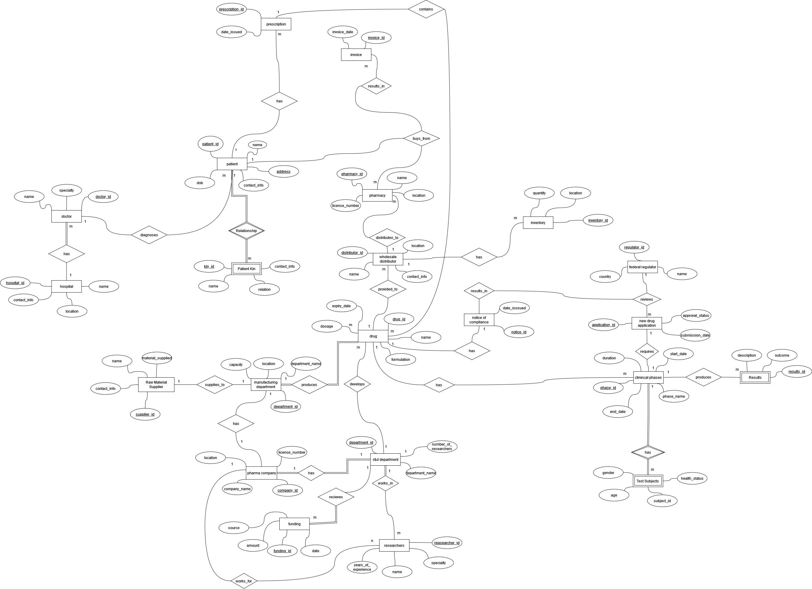
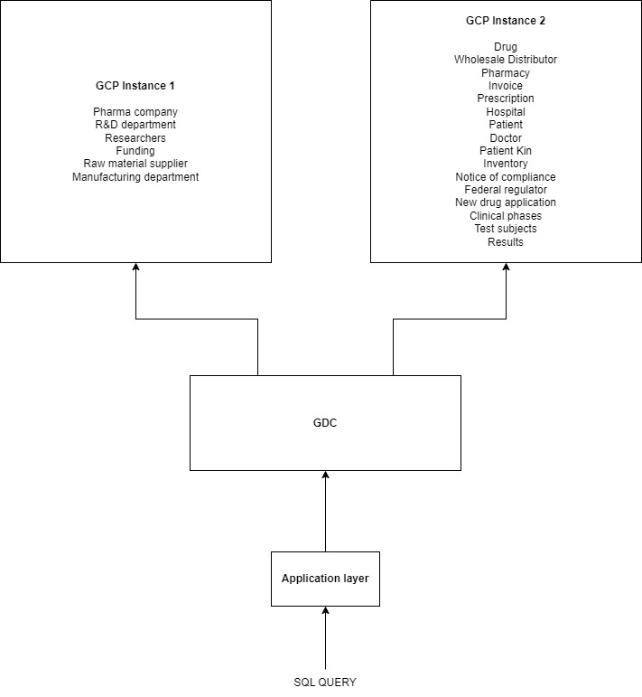

# Distributed Database for Healthcare Industry

## Project Overview

This project involves the design and implementation of a distributed database system that integrates pharmaceutical company, healthcare providers, and regulatory authorities. The system is built on two Google Cloud Platform (GCP) instances, each hosting distinct sets of data relevant to the zone where the instance is located, for example infomation related to drugs and its subsidiary are in US instance zone as they will be accessed frequently in there as the customers are american citizens. Moreover, data related to manufacturing and raw materials is in INDIA instance zone, as the manufacturers are based in India. The distributed architecture ensures secure, efficient, and scalable data management across multiple organizations.

## Key Highlights:

1. 📂 Global Data Catalog (GDC): Created a custom Global Data Catalog (GDC) to streamline the retrieval of data from distributed database locations.

2. 📊 Data Modeling: Developed comprehensive Entity-Relationship Diagrams (ERDs) and Enhanced Entity-Relationship Diagrams (EERDs) to accurately represent the relationships and entities essential to event management.

3. ⚙️ Data Optimization: Normalized the data structure to reduce redundancy and resolved fan and chasm traps, enhancing the database's efficiency.

4. 🌍 Horizontal Fragmentation: Applied strategic horizontal fragmentation to distribute SQL database tables across virtual machines (VMs) in different locations, ensuring the separation of private and sensitive information for improved data privacy and security.

While cloud services offer tools for such tasks, building this solution from the ground up provided me with invaluable insights into the complexities of managing data in the hospitality sector.

Challenges Overcome:

1. 🔐 Ensuring efficient fragmentation to securely manage sensitive event-related data across multiple locations.
2. 🔍 Identifying the most relevant fields for the GDC to facilitate efficient data access.

## System Architecture

The system architecture is divided into two main GCP instances, each serving specific functions:

-   **GCP Instance 1 (India)**: Hosts data related to pharmaceutical companies, research and development (R&D), raw material suppliers, manufacturing departments, and funding sources.
-   **GCP Instance 2 (USA)**: Manages data related to drugs, wholesale distributors, pharmacies, hospitals, patients, doctors, clinical trials, federal regulators, and test results.

These instances are connected through a Global Data Center (GDC), which serves as the central hub for data integration and retrieval. The GDC interacts with an application layer, allowing users to run SQL queries to access and manipulate data across both GCP instances.

## Entity Relationship Diagram

## Visual Representation

Below is the visual representation of the system architecture:

Below is the architecture diagram:

## Components

### GCP Instance 1

-   Pharma Company
-   R&D Department
-   Researchers
-   Funding
-   Raw Material Supplier
-   Manufacturing Department

### GCP Instance 2

-   Drug
-   Wholesale Distributor
-   Pharmacy
-   Invoice
-   Prescription
-   Hospital
-   Patient
-   Doctor
-   Patient Kin
-   Inventory
-   Notice of Compliance
-   Federal Regulator
-   New Drug Application
-   Clinical Phases
-   Test Subjects
-   Results

### Global Data Center (GDC)

The GDC acts as the central repository that integrates data from both GCP instances. It processes SQL queries from the application layer and provides the necessary data to the user.

### Application Layer

The application layer is the user interface that allows users to interact with the distributed database system. Users can execute SQL queries to retrieve and manipulate data from both GCP instances through the GDC.

## Technologies Used

-   **Google Cloud Platform (GCP)**: Cloud infrastructure for hosting the distributed database instances.
-   **SQL**: Query language for data retrieval and manipulation.
-   **Distributed Database Design**: The system is designed using distributed database principles, ensuring data is stored across multiple locations to enhance availability, fault tolerance, and performance.

## Detailed Report

For a more detailed insight of the distributed Database approach, please refer to the in-depth report here, [Project Specification](./docs/DDB_Final_report.pdf)

